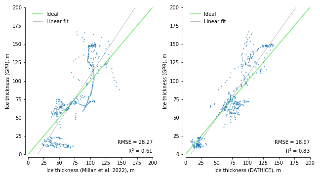

# DATHICE: Data-Assisted THickness correction for ICE

<!-- [Konstantin A. Maslov](https://people.utwente.nl/k.a.maslov) -->

[[`Installation`](#installation)] [[`Getting started`](#getting-started)] [[`BibTeX`](#citing)] 

<br/>



This short exercise demonstrates a simple hybrid-physics-data model (inspired by [Daw et al. 2017](https://arxiv.org/abs/1710.11431)) that is trained to correct the modelled data from [Millan et al. 2022](https://www.nature.com/articles/s41561-021-00885-z). 
It adapts and improves upon traditional physical models by incorporating ground-penetrating radar data to correct inaccuracies. 
This method involves training a deep learning model to adjust the ice thickness measurements based on discrepancies identified between the physically modeled data and GPR observations from three distinct glaciers in Svalbard&mdash;Scott Turnerbreen, Drønbreen and Jinnbreen. 
The correction relies and two coregistered elevation models (Cop30DEM and ArcticDEM) as well as the inputs for physical modelling (remotely sensed glacier surface velocities) and the modelled thickness itself. 
The improved predictions offer a \[slightly\] more accurate assessment of ice thickness and glacier volumes (up to ~30%).

This repository is used mainly as a teaching resource and does not claim to have high scientific value. 

## Installation

\[**NOT RECOMMENDED**\] The repository provides the `env.yml` file, which can be used to reproduce the environment with, e.g., `conda` by running
```
conda env create -f env.yml
```

However, this is likely to fail as the installation process of JAX might be complicated in some configurations.
I highly recommend to install JAX as explained [here](https://jax.readthedocs.io/en/latest/installation.html) and install manually other dependencies: `optax`, `rioxarray`, `geopandas`, `pandas`, `matplotlib`, `jupyterlab` and (optionally) `tqdm`. 
It might take some time to figure out which versions of the packages work best for you. 

As this exercise is really simple and do not require a lot of computational resources, it is also a good idea to install a CPU version of JAX, which is usually much easier to deal with.

## Getting started

To start, download [the raster data](https://bit.ly/4gce19k) data and put them into `data/raster/`.
The whole workflow consists of three Jupyter notebooks which are supposed to be run one-by-one:
1. [`data_preparation.ipynb`](data_preparation.ipynb)
2. [`modelling.ipynb`](modelling.ipynb)
3. [`testing.ipynb`](testing.ipynb)
Note, however, that the repository also contains all intermediate results, so you are free to skip any of the notebooks.

Some notebooks contain 'tasks' marked with `""" EXERCISE: ... """`, which I encourage to do. 

## Acknowledgements

I acknowledge the contributions of my peers and instructors, particularly [Prof. Andrew Hodson](https://www.unis.no/staff/andy-hodson/) and [Erik Schytt Mannerfelt](https://www.mn.uio.no/geo/english/people/aca/geohyd/erikmann/), from the [AG-325/825 course at the University Centre in Svalbard (UNIS)](https://www.unis.no/courses/ag-825-glaciology/) in the collection and interpretation of the low-frequency GPR data for ice thickness mapping in February 2024. 
Their assistance was essential for this project. 

## License

This software is licensed under the [GNU General Public License v2](LICENSE).

## Citing

```
@misc{dathice_2024,
    title  = {{DATHICE: Data-Assisted THickness correction for ICE}},
    author = {Maslov, Konstantin A.},
    url    = {https://github.com/konstantin-a-maslov/dathice},
    year   = {2024},
}
``` 
